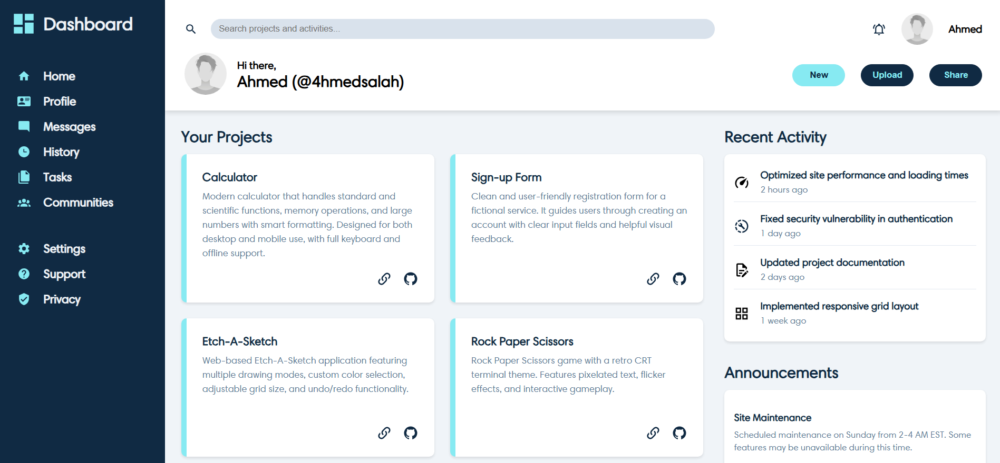

# Admin Dashboard

<a href="https://opensource.org/licenses/MIT"></a>

A modern, responsive admin dashboard interface built with HTML5 and CSS3. Features a clean project portfolio, activity tracking, and announcements system with semantic structure and professional design.

**[Live Preview](https://4hmedsalah.github.io/admin-dashboard/)**



<div align="center">
  <a href="https://developer.mozilla.org/en-US/docs/Web/HTML"></a>
  <a href="https://developer.mozilla.org/en-US/docs/Web/CSS"></a>
</div>

## Features

- **Responsive Grid Layout:** CSS Grid main structure with Flexbox components for optimal responsiveness.
- **Project Portfolio:** Showcase of live projects with direct links to GitHub repositories and live previews.
- **Activity Tracking:** Recent activity feed with timestamps and visual indicators.
- **Announcements System:** notifications and updates section.
- **Semantic HTML:** Accessible structure with proper navigation elements.
- **Custom Typography:** Harmonia Sans font with system font fallbacks for professional appearance.
- **SVG Icon System:** Scalable vector graphics for crisp visuals at any resolution.

## Installation

### Running Locally

1. Clone this repository:
   ```zsh
   git clone https://github.com/4hmedsalah/admin-dashboard.git
   ```
2. Navigate to the project directory:
   ```zsh
   cd admin-dashboard
   ```
3. Open the `index.html` file in your preferred web browser.

### Live Preview

Visit the [**Live Preview**](https://4hmedsalah.github.io/admin-dashboard/) to view the dashboard immediately without any installation.

## Technologies Used

- **HTML5** - Semantic markup with accessibility considerations
- **CSS3** - Modern styling with Grid, Flexbox, and custom properties

No external frameworks or libraries are used, ensuring a lightweight and fast-loading interface with minimal dependencies.

## Featured Projects

The dashboard showcases several live projects with interactive cards:

- **[Calculator](https://4hmedsalah.github.io/calculator/)** - Modern calculator with scientific functions
- **[Sign-up Form](https://4hmedsalah.github.io/sign-up-form/)** - Clean registration form with validation
- **[Etch-A-Sketch](https://4hmedsalah.github.io/etch-a-sketch/)** - Interactive drawing application
- **[Rock Paper Scissors](https://4hmedsalah.github.io/rock-paper-scissors/)** - Retro CRT-themed game

## Design Highlights

- **Professional Color Scheme:** Carefully selected color palette for a modern look
- **Intuitive Navigation:** Sidebar with clear icons and organized sections
- **Interactive Elements:** Hover effects and visual feedback for better UX
- **Responsive Design:** Adapts seamlessly to different screen sizes
- **Accessibility First:** Semantic HTML and proper alt text for screen readers

## License

This project is licensed under the MIT License - see the [MIT License](LICENSE) file for details.

## Contributing

Contributions are welcome! Feel free to submit a pull request or open an issue for any bugs or feature requests.
